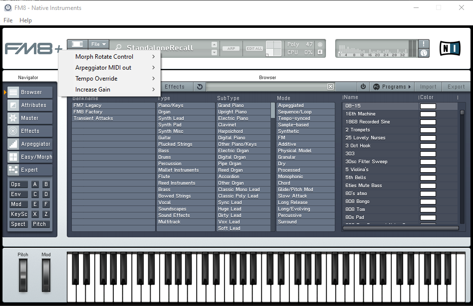
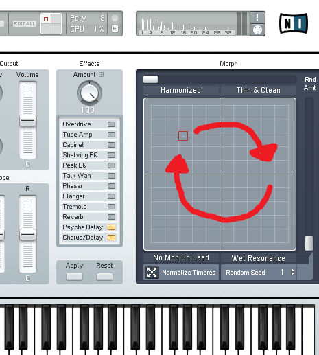

# FM8.plus



[](https://github.com/musicastudio/FM8.plus/blob/main/LICENSE)
[](https://github.com/musicastudio/FM8.plus/releases/latest)

An enhancement layer for Native Instruments FM8 v1.4.6 (last release 2022-12-23, Windows x64). It adds new features to the standalone `FM8.exe`, the 64-bit VST2 `FM8.dll`, and `FM8.vst3`

## Features

1. **Morph Rotate Control.** Map any MIDI CC (Off, or CC 0..127 with names) to a rotation of the Morph square handle, so one controller sweeps a circle through all four timbres. The on-screen handle follows, and the chosen CC is blocked from its normal FM8 function so it drives only the morph.
2. **Arpeggiator MIDI out.** Three modes for the built-in arpeggiator: **Internal** (stock, nothing leaves), **Clone to MIDI** (FM8 plays the arp and the arp notes are sent to the plugin MIDI output), and **MIDI only** (the arp notes are sent out and FM8's own voices stay silent, so one FM8 can drive another instrument).
3. **Tempo Override.** Unshackle the arp from the DAW tempo: Off, 0.25x, 0.5x, 2x, 4x of host tempo, or Custom (frees FM8's own arp Tempo control). VST2 scales the host time FM8 reads; VST3 scales the process context.
4. **Increase Gain.** Push the output beyond the normal level: Off, +1 dB up to +10 dB, applied post-fader on the plugin output.

**To access these features, click the `+` next to FM8 to open the menu.**

Per-instance settings (morph CC, arp mode, tempo, gain) travel with the DAW project via the plugin state; global defaults live in `%APPDATA%\FM8.plus\FM8.plus.ini`.

## Install

Download the latest installer from the [Releases page](https://github.com/musicastudio/FM8.plus/releases/latest) and run it. It needs administrator rights, since FM8 lives under Program Files. It installs FM8.plus as its own files next to your existing FM8: `FM8.plus.dll` in the VST2 folder, `FM8.plus.vst3` in the VST3 folder, and an `FM8.plus.exe` launcher in FM8's program folder, plus a desktop shortcut and a Start Menu entry beside FM8's own. It never renames, copies, or modifies a stock FM8 file, so a Native Access repair or update cannot break it, and uninstalling simply removes the FM8.plus files. Only the final 2022-12-23 v1.4.6 build gains the features; any other build is loaded and left as plain FM8. Rescan plugins in your DAW afterwards, and FM8+ appears alongside FM8.

Prefer scripts, or building it yourself? From an elevated PowerShell run `powershell -ExecutionPolicy Bypass -File installer\install.ps1`, and `installer\uninstall.ps1` removes everything again.

## Background and How it was made

Having the Arpeggiator provide MIDI output is one of the most requested features for FM8, appearing on Reddit and various forums, and something I have wanted for a long time.

Next, an idea I've wanted for a while was using the modwheel (or another midi CC) to rotate the morph control, as the morph tool allows for some incredible texture variations and transitions. This idea was even asked by me on the Native Instruments forums in 2013, where I shared this diagram:

<kbd>

</kbd>
<br /><br />

More ideas came from the internet, with [this reddit wishlist by Manifold_dnb](https://www.reddit.com/r/edmproduction/comments/7o87oy/native_instruments_fm9_wishlist_fm8/) containing some relatively easy to implement ideas, like DAW tempo detachment and increasing the output gain.

**Can modern AI tooling allow us to make these "dreams" a reality?**

Using Claude Fable 5.1, The three modules (the standalone `FM8.exe`, the VST2 `FM8.dll`, and `FM8.vst3`) were disassembled with [Ghidra](https://ghidra-sre.org/), and the decompiled C was read function by function to locate the internal machinery each feature had to reach, namely the arpeggiator dispatch, the MIDI event handler, the internal Morph X/Y setter, and the form resource that holds the FM8 logo.

Claude worked through Ghidra's decompiler output, proposed and adversarially checked where each hook belonged, and confirmed the target functions are byte-identical across all three binaries so one set of detours works in every host. From there it wrote the hook code, the per-host proxies, and the headless test hosts that verify each feature against the real FM8, and the whole thing was built and checked with the model in the loop end to end. The reverse-engineering notes and the exact hook addresses are in [docs/hooks.md](docs/hooks.md) and [docs/design.md](docs/design.md).

To be clear about what that means, this repository contains no Native Instruments source and no decompiled FM8 content. The analysis only informed where FM8.plus attaches its own code at runtime; the stock binaries are never touched on disk.

As of September 2026, frontier LLMs can read disassembled code at a level close to the original source code. We are seeing the emergence of a new era of user-led modification and enhancements to proprietary software.

## How it works

FM8.plus is a distinct plug-in that loads the real FM8 in place, never touching it on disk. The VST2 `FM8.plus.dll` and VST3 `FM8.plus.vst3` install beside stock FM8 and load it from the same folder, then present themselves to the host as "FM8+" with their own plug-in IDs, so they coexist with plain FM8: existing projects keep loading stock FM8, and you reach for FM8+ where you want the features. Because they share FM8's own module in memory, the feature hooks are gated to FM8+ instances only, leaving plain FM8 completely stock. The standalone `FM8.plus.exe` launcher starts the untouched `FM8.exe` and injects the same code at startup, so plain `FM8.exe` also stays plain. This is why a Native Access repair or update never breaks FM8.plus: our files are only ever added alongside FM8, never in place of it.

The core detours two internal FM8 functions that are byte-identical across all three binaries (the arpeggiator dispatch and the MIDI event handler), captures the arp's generated notes, and sends them out through each host's native path: VST2 `audioMasterProcessEvents`, a VST3 `data.outputEvents` bus that the wrapper adds for its own instances (stock FM8 exposes none), and standalone WinMM `midiOutShortMsg`. The selected morph CC is captured the same way and drives FM8's own internal Morph X/Y setter, tempo is rescaled in the host time FM8 reads, and extra gain is applied to the rendered output buffers. The "FM8" wordmark is a PICTURE control in FM8's form resources, so room for the "+" is made by patching that control's rectangle 11px left in memory before the GUI is built. Hook addresses are in [docs/hooks.md](docs/hooks.md) and [src/core/rvas.h](src/core/rvas.h); the design rationale is in [docs/design.md](docs/design.md).

Every hook is guarded by the FM8 build's PE timestamp; on any mismatch the layer degrades to plain forwarding rather than risk a crash, so a Native Access repair or a different FM8 version is safe.

## Build

Needs Visual Studio 2022 (x64), CMake, and the two vendored submodules.

```bash
git submodule update --init --recursive
cmake -S . -B build -G "Visual Studio 17 2022" -A x64
cmake --build build --config Release
```

Outputs in `build\Release`: `FM8.plus.dll` (VST2 wrapper), `FM8.plus.vst3` (VST3 wrapper), and `FM8.plus.exe` (standalone launcher). `installer\FM8.plus.iss` is an Inno Setup script that packages them into the setup installer, and `installer\build_installer.ps1` compiles it. The FM8+ icon is FM8's own program icon with a "+" added, so it is never shipped here: at install time `tools\make_icon.ps1` composites it on your machine from your own FM8 install and `installer\icon_overlay.ico` (the only icon artwork in this repo), then injects it into your installed `FM8.plus.exe` as its icon resource. The binaries we distribute carry no Native Instruments artwork.

## Layout

```
FM8.plus/
  src/core/         shared feature core (hooks, arp routing, morph, settings, UI, standalone attach, rvas.h)
  src/shim_vst2/    VST2 wrapper -> FM8.plus.dll
  src/shim_vst3/    VST3 wrapper -> FM8.plus.vst3
  src/launcher/     standalone launcher -> FM8.plus.exe
  src/vst2/         minimal VST 2.4 ABI header
  docs/             design, reverse-engineering notes, hook reference, status
  tools/            pyghidra helpers, the headless VST2/VST3 test hosts, and make_icon.ps1
  installer/        PowerShell + Inno Setup installers and the "+" overlay icon
../FM8_DISASM/      binaries and Ghidra projects (not in git)
```

## Status

All four features are verified end to end against the real FM8 with the headless host in `tools/vst2host.py`, running the FM8+ VST2 wrapper as it ships (arp MIDI out in every mode, morph on an arbitrary CC with the CC blocked from FM8, tempo scaling, and gain), and the VST2 wrapper reports its own distinct identity. The VST3 wrapper is verified headless too: it presents FM8+ and FM8 FX+ as distinct plug-ins and adds the "FM8+ Arp Out" event bus only to its own instances. The standalone launcher is verified to start FM8 and inject the features. A full audio-path pass inside a DAW is the remaining check; see [docs/status.md](docs/status.md).

## Licence

FM8.plus is released under the GNU General Public License v3.0; see [LICENSE](LICENSE).

It is an independent interoperability add-on for software you already own. Other than a documentation screenshot of FM8 in use, it ships no Native Instruments code or artwork, loads your installed FM8 at runtime, and reverses none of its content into the repository; build and use your own copy, and do not redistribute FM8 itself. The FM8+ shortcut icon is composited on your own machine at install time from your own FM8 installation, so no Native Instruments icon is distributed with FM8.plus. The "+" glyph is drawn directly as a slanted cross in our own code, so FM8.plus bundles no third-party font or artwork of any kind.
